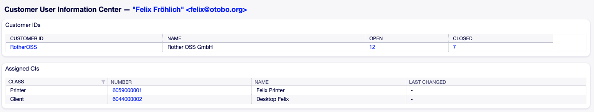
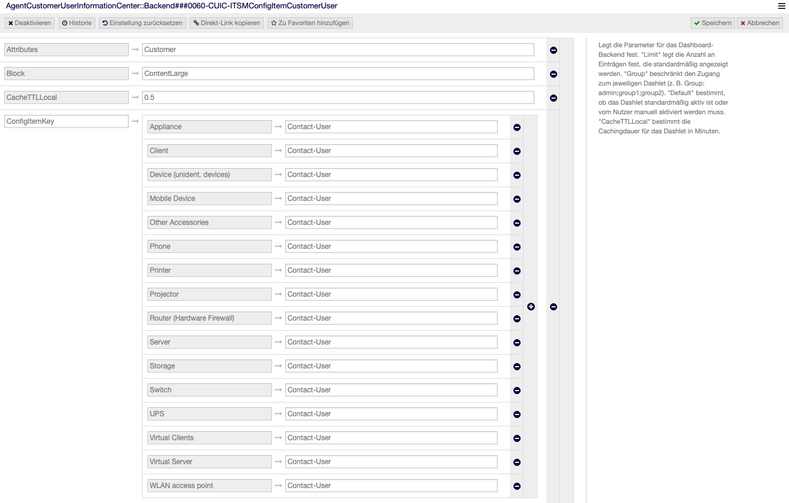
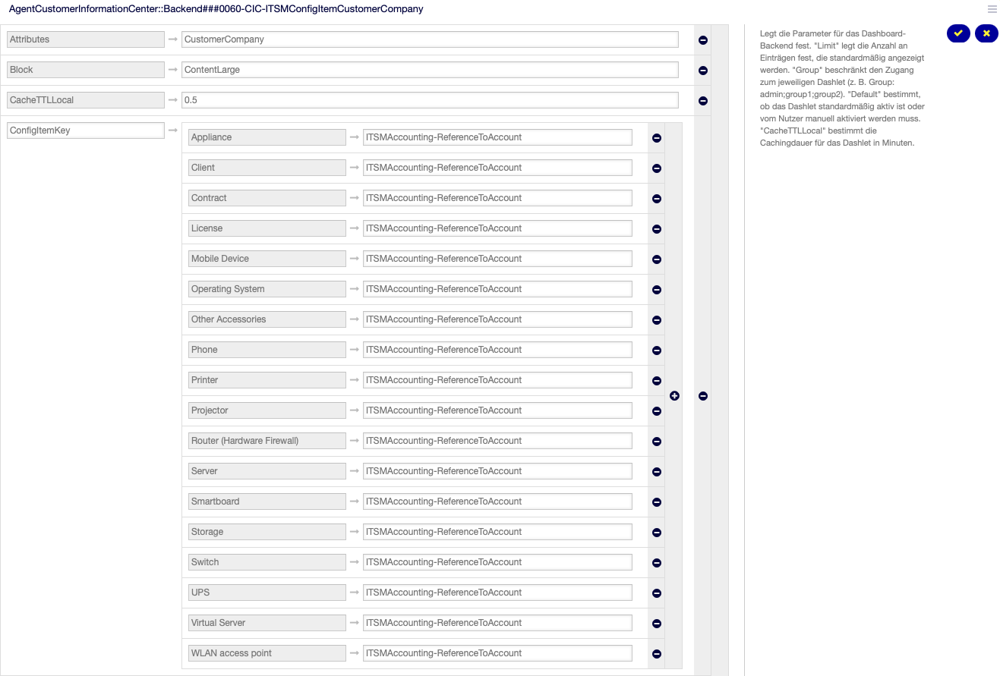

Basic Configuration
===================
In this section, you will learn all necessary steps to set up a basic but usable CMDB with the most commonly used Configuration Items (CIs).

Assign Agent Permissions
------------------------
Agents who need access to CIs in the Configuration Management Database (CMDB) must be assigned to the group "itsm-configitem".

Import the Ready to Adopt ConfigItem Classes
--------------------------------------------

.. attention::

    Importing the Ready2Import classes will create a large number of dynamic fields and is not automatically reversible. If in doubt, consider trying this on a non-productive system first.

OTOBO provides the option to import class bundles that showcase some of the most commonly used Configuration Items (CIs).  
To get started, perform the following steps:

#. Open the admin view of your OTOBO Web UI.
#. Navigate to **Config Items** in the **CMDB Settings** section.
#. Locate the **Ready2Import Class Bundles** panel on the left side and select the class bundle you want to import.

   .. figure:: ../images/ready2import_class_bundles.png
      :scale: 65%
      :alt: Ready2Import Class Bundles panel

#. Click the button to import the Ready2Adopt class bundles.

Assign Customer Permissions (Optional)
--------------------------------------
To provide customer access to CIs, enable the following system configuration settings:

- *CustomerFrontend::Module###CustomerITSMConfigItem*
- *CustomerFrontend::Module###CustomerITSMConfigItemSearch*
- *CustomerFrontend::Module###CustomerITSMConfigItemZoom*
- *Customer::ConfigItem::PermissionConditions###01*: A basic example permission condition granting customer users access to all CIs

If needed, the permission condition can be customized and expanded in the respective system configuration settings.

Viewing Assigned Configuration Items (CIs) for Customer Users or Customer Companies (Optional)
----------------------------------------------------------------------------------------------
You can enable the display of linked Configuration Items (CIs) for Customer Users or Customer Companies in the respective Information Centers.

**Example: Assigned CIs for a Customer User**

Steps to Enable Viewing Assigned CIs
^^^^^^^^^^^^^^^^^^^^^^^^^^^^^^^^^^^^
To display assigned CIs in the Customer User Information Center or the Customer Company Information Center, modify the following system configuration settings:

- *AgentCustomerUserInformationCenter::Backend###0060-CUIC-ITSMConfigItemCustomerUser* for Customer User Information Center.
- *AgentCustomerInformationCenter::Backend###0060-CIC-ITSMConfigItemCustomerCompany* for Customer Company Information Center.

Configuration instruction per setting:

1. In the ConfigItemKey section of the respective setting, click the plus sign to add a new entry.
2. In the first row, specify the name of the CI class you want to display.
3. In the second row, provide the link reference.

**Example Configuration for Customer User Information Center**

**Example Configuration for Customer Company Information Center**

Change common settings for Config Item Classes (Optional)
---------------------------------------------------------
Classes of CIs provide possibilites for customization. To change general attributes of a CI class, perform the following steps:

#. Open the admin view of your OTOBO Web UI.
#. Navigate to **General Catalog** in the **Administration** section.
#. Locate the **Catalog Class** table in the middle and click the entry **ITSM::ConfigItem::Class**.
#. Locate the **Name** table in the middle and click the class name of the class you want to edit.

Among the attributes customizable are for instance the permission groups providing access to CIs of the respective class as well as the categories.

Change advanced settings for Config Item Classes (Optional)
-----------------------------------------------------------
Additionally, appearance and data related to a CI class can be changed in the Admin Config Item screen:

#. Open the admin view of your OTOBO Web UI.
#. Navigate to **Config Items** in the **CMDB Settings** section.
#. Locate the **Actions** panel on the left side and select the class you want to edit.
#. Click the button **Change class definition**.

In the YAML editor on the page you can configure various things, such as dynamic fields used as attributes for the class and the appearance of CIs belonging to the class in the zoom views.

Customize attributes shown in Config Item overview (Optional)
-------------------------------------------------------------

For configuring the attributes available and viewable in Config Item overviews, the following system configuration settings can be used:

- *ITSMConfigItem::Frontend::AgentITSMConfigItem###ClassColumnsAvailable*
- *ITSMConfigItem::Frontend::AgentITSMConfigItem###ClassColumnsDefault*
- *ITSMConfigItem::Frontend::CustomerITSMConfigItem###ClassColumnsAvailable*
- *ITSMConfigItem::Frontend::CustomerITSMConfigItem###ClassColumnsDefault*
