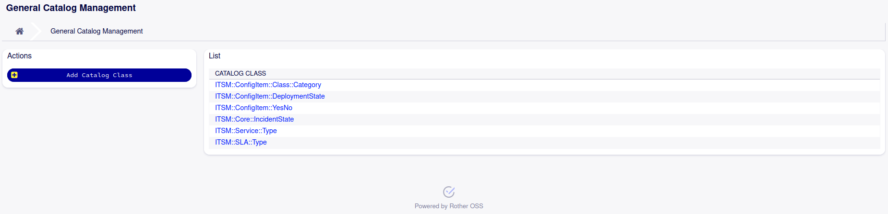
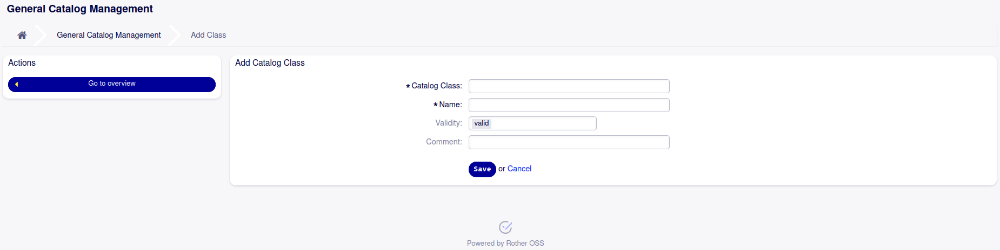
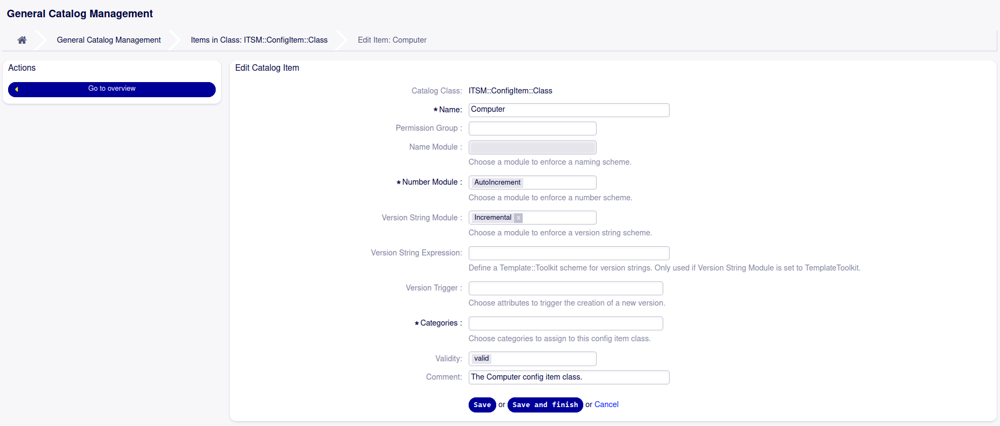

.. _general-catalog-classes:

General Catalog Classes of the CMDB
^^^^^^^^^^^^^^^^^^^^^^^^^^^^^^^^^^^

Classes
"""""""

For using Config Item Classes, either the Ready2Adopt Classes, provided by the package, can be imported, or own customized Classes can be created. For doing so, please navigate to the Admin-Interface of the General Catalog. After installing the package, it looks like this:

For creating the first Config Item Class, you need to click on the button "Add Catalog Class". The following mask gives you a limited set of attributes to fill in.

Fill in the Catalog Class ('ITSM::ConfigItem::Class' in case of Config Item Classes), the name and choose a validity. Optionally a comment can be provided. When saving this information, you are redirected to the same edit mask, but with the additional attributes unique to Config Item Classes, which are the following:

    - **Access Group**: Controls user (agent) access to this class.
    - **Name Module**: No functionality in the default OTOBO Core installation. Allows extensions to automatically set CI names.
    - **Number Module**: Module used to define visible CI Numbers (in contrast to their internal IDs - compare TicketNumber and -ID)
    - **Version-String Module**: Versions can either be incremental (1, 2, 3,...) (default), defined by a Template Toolkit expression from the respectively current attributes of the CI, or (if left empty) be manually defined when adding/editing CIs in the frontend.
    - **Version-String Expression**: Currently only used in combination with the version string module "Template Toolkit"
    - **Version Trigger**: Defines which attributes trigger the creation of a new version when changed. See :ref:`versioning_and_history`.
    - **Categories**: Which categories this class should be listed in in the CI Overview of the agent interface.

Categories
""""""""""

A collection of categories (ITSM::ConfigItem::Class::Category) which are used to organize classes in the Agent Frontend.

.. _roles:

Config Item Roles
"""""""""""""""""

Config Item Roles available on the system (ITSM::ConfigItem::Role). Can be defined and used in Admin->ConfigItem to define common sets of attributes between CI classes into a section, making it reusable across different areas.

Deployment States
"""""""""""""""""

The Deployment State of a CI describes the current stage it's reached in its lifecycle (e.g. from planned to decommissioned). You can maintain and customize the field values for the Deployment State in the General Catalog (ITSM::ConfigItem::DeploymentState). Plus, you can assign a unique color code to each Deployment State, providing a quick visual cue for the current status.

Incident States
"""""""""""""""

The Incident State of a CI describes its current production state (e.g., operational, incident). You can maintain and customize the available field values for this state in the General Catalog (ITSM::Core::IncidentState). The Incident State is displayed as a traffic light system in views (like the TreeView). 
